# 为家航 — 全平台架构链路图

> 可编辑 Mermaid 图表集 · 覆盖 5 个子项目 · 最后更新 2026-06-25
>
> **编辑方式**: 直接修改代码块中的 Mermaid 语法，VS Code 安装 `Markdown Preview Mermaid` 插件即可预览。

---

## 目录

1. [端到端汇总链路图](#一端到端汇总链路图)
2. [C端小程序链路图](#二c端小程序链路图-miniapp)
3. [领航员端链路图](#三领航员端链路图-navigator)
4. [商户端链路图](#四商户端链路图-merchant)
5. [管理后台链路图](#五管理后台链路图-admin)
6. [后端服务拓扑图](#六后端服务拓扑图-server)
7. [关键业务流程序列图](#七关键业务流程序列图)

---

## 一、端到端汇总链路图

```mermaid
graph TB
    subgraph 外部服务["🌐 外部服务"]
        WX[微信开放平台<br/>登录/支付/通知]
        TM[腾讯地图API<br/>室内导航/路径规划]
        CLAUDE[Claude API<br/>AI对话/材料计算]
        TYQW[通义千问<br/>备用AI引擎]
        SMS[短信服务<br/>验证码/通知]
    end

    subgraph 硬件层["📡 硬件层"]
        BLE[BLE蓝牙信标<br/>室内定位精度3-5m]
    end

    subgraph 后端["🖥️ NestJS 后端 :3001"]
        GW[API网关<br/>限流/CSRF/Helmet/CORS]
        AUTH[认证模块<br/>JWT签发+验证]
        MQ[WebSocket网关<br/>即时通讯+订单推送]
        DB[(PostgreSQL 17<br/>+ PostGIS 3.6)]
        REDIS[(Redis 5.0<br/>缓存+Session)]
        SQLITE[(SQLite<br/>开发环境)]
    end

    subgraph C端["📱 C端小程序 - 业主/采购商"]
        C1[首页·商品浏览<br/>6页]
        C2[交易链路<br/>8页]
        C3[AI工具<br/>2页]
        C4[地图导航<br/>2页]
        C5[个人中心<br/>7页]
    end

    subgraph 领航员["📱 领航员小程序 - 线下服务人员"]
        N1[接单大厅<br/>WebSocket实时抢单]
        N2[订单履约<br/>到达→验货→完成]
        N3[收益提现<br/>等级勋章]
        N4[培训考试<br/>数据统计]
    end

    subgraph 商户["💻 商户端 React SPA - 市场商家"]
        M1[店铺·商品管理<br/>CRUD+批量操作]
        M2[订单·评价<br/>履约+回复]
        M3[营销·推广<br/>活动+广告]
        M4[财务·分析<br/>流水+报表]
    end

    subgraph 管理后台["💻 管理后台 React SPA - 平台运营"]
        A1[审核中心<br/>商家·领航员·评价]
        A2[运营管理<br/>用户·市场·订单纠纷]
        A3[营销体系<br/>广告·活动·优惠券·话术]
        A4[交易管理<br/>采购订单·结算]
        A5[系统运维<br/>财务·信标·配置·审计]
    end

    %% 外部连接
    WX <-->|OAuth2.0| AUTH
    TM <-->|REST API| GW
    CLAUDE -->|流式SSE| GW
    TYQW -->|备用| GW
    SMS --> GW

    %% BLE连接
    BLE -->|RSSI信号| C4

    %% 后端内部
    GW --> AUTH
    GW --> MQ
    AUTH --> DB
    AUTH --> REDIS
    DB -.->|开发环境| SQLITE

    %% C端连接
    C1 -->|HTTP REST| GW
    C2 -->|HTTP REST| GW
    C3 -->|SSE流式| GW
    C4 -->|HTTP + BLE| GW
    C5 -->|HTTP REST| GW
    C3 -->|WebSocket| MQ

    %% 领航员连接
    N1 -->|WebSocket| MQ
    N1 -->|HTTP REST| GW
    N2 -->|HTTP REST| GW
    N3 -->|HTTP REST| GW
    N4 -->|HTTP REST| GW

    %% 商户连接
    M1 -->|HTTP REST| GW
    M2 -->|HTTP REST| GW
    M3 -->|HTTP REST| GW
    M4 -->|HTTP REST| GW

    %% 管理后台连接
    A1 -->|HTTP REST| GW
    A2 -->|HTTP REST| GW
    A3 -->|HTTP REST| GW
    A4 -->|HTTP REST| GW
    A5 -->|HTTP REST| GW

    %% 跨端数据流
    C2 -.->|下单触发| N1
    N2 -.->|履约状态| C2
    C2 -.->|下单关联| M2
    N2 -.->|到店确认| M1
    A1 -.->|审核通过| N1
    A1 -.->|审核通过| M1
    A4 -.->|结算打款| N3

    style WX fill:#07C160,color:#fff
    style TM fill:#0099FF,color:#fff
    style CLAUDE fill:#D97706,color:#fff
    style 后端 fill:#1A365D,color:#fff
    style C端 fill:#FF6B35,color:#fff
    style 领航员 fill:#1677FF,color:#fff
    style 商户 fill:#52C41A,color:#fff
    style 管理后台 fill:#FAAD14,color:#000
```

### 数据流说明

| 流向 | 协议 | 说明 |
|------|------|------|
| 小程序 ↔ 后端 | HTTPS REST | 所有CRUD操作，Bearer Token认证 |
| 小程序 → 后端 | SSE | AI对话流式响应 |
| 领航员 ↔ 后端 | WebSocket | 订单推送、抢单、心跳(25s) |
| 商户 ↔ 后端 | HTTPS REST | 店铺管理、订单履约 |
| 管理后台 ↔ 后端 | HTTPS REST | 全平台管理操作 |
| 小程序 ↔ BLE信标 | 蓝牙4.0 | RSSI信号→三角定位，精度3-5m |
| 后端 → 腾讯地图 | HTTPS REST | 室内路径规划 |
| 后端 → Claude API | HTTPS SSE | AI对话、材料计算 |

---

## 二、C端小程序链路图 (Miniapp)

### 2.1 页面路由全景

```mermaid
graph TB
    subgraph 启动["🚀 启动"]
        SPLASH[splash<br/>启动页·指南针动画]
        ONBOARD[onboarding<br/>首次引导·3屏轮播]
    end

    subgraph TabBar["📋 底部TabBar 5页"]
        INDEX[index<br/>🏠 首页]
        AI[ai-chat<br/>🤖 AI助手]
        MSG[messages<br/>💬 消息]
        ORDERS[orders<br/>📦 订单]
        MINE[mine<br/>👤 我的]
    end

    subgraph 商品浏览["🛍️ 商品浏览 6页"]
        SHOP_LIST[shop-list<br/>商品列表·搜索·筛选]
        SHOP_DETAIL[shop-detail<br/>店铺详情·加购]
        PROD_DETAIL[product-detail<br/>商品详情·参数]
        MARKET_DETAIL[market-detail<br/>市场详情·地图+瀑布流]
        FEED[feed<br/>聚合页·精选/灵感/特惠]
        FAV[favorites<br/>收藏夹·店铺/商品]
    end

    subgraph 交易链路["💳 交易链路 8页"]
        CART[cart<br/>购物车·按店铺分组]
        SETTLE[settle<br/>结算·定价引擎]
        ORDER_CREATE[order-create<br/>创建领航员服务订单]
        ORDER_DETAIL[order-detail<br/>订单详情·保障链]
        ORDER_PROD[order-product<br/>商品下单(旧)]
        DISPUTE[dispute<br/>售后纠纷]
    end

    subgraph AI工具["🧠 AI工具 2页"]
        AI_CALC[ai-calc<br/>材料计算·3种模式]
    end

    subgraph 地图导航["🗺️ 地图导航 2页"]
        MAP[map<br/>全屏地图·楼层切换]
        CITY_SELECT[city-select<br/>城市选择·36城]
    end

    subgraph 个人中心["⚙️ 个人中心 7页"]
        PROFILE_EDIT[profile-edit<br/>资料编辑]
        ADDR_LIST[address-list<br/>地址列表]
        ADDR_EDIT[address-edit<br/>地址编辑]
        SETTINGS[settings<br/>设置]
        SERVICE[service<br/>客服帮助]
        FEEDBACK[feedback<br/>意见反馈]
        COUPONS[coupons<br/>优惠券]
    end

    SPLASH -->|首次| ONBOARD
    SPLASH -->|非首次| INDEX
    ONBOARD --> INDEX

    INDEX --> SHOP_LIST
    INDEX --> SHOP_DETAIL
    INDEX --> MARKET_DETAIL
    INDEX --> FEED
    INDEX --> MAP
    INDEX --> CITY_SELECT

    SHOP_LIST --> SHOP_DETAIL
    SHOP_DETAIL --> PROD_DETAIL
    SHOP_DETAIL --> CART
    MARKET_DETAIL --> SHOP_DETAIL
    MARKET_DETAIL --> MAP
    FEED --> PROD_DETAIL
    FEED --> SHOP_LIST
    FAV --> SHOP_DETAIL

    CART --> SETTLE
    SETTLE --> ORDER_CREATE
    SETTLE --> ADDR_LIST
    ADDR_LIST --> ADDR_EDIT
    ORDER_CREATE --> ORDERS
    ORDERS --> ORDER_DETAIL
    ORDER_DETAIL --> DISPUTE
    ORDER_DETAIL --> SERVICE

    AI --> AI_CALC
    AI --> SHOP_DETAIL
    AI --> ORDER_CREATE

    MINE --> PROFILE_EDIT
    MINE --> ORDERS
    MINE --> ADDR_LIST
    MINE --> FAV
    MINE --> AI_CALC
    MINE --> COUPONS
    MINE --> FEEDBACK
    MINE --> SERVICE
    MINE --> SETTINGS

    style 启动 fill:#1A365D,color:#fff
    style TabBar fill:#FF6B35,color:#fff
    style 商品浏览 fill:#1677FF,color:#fff
    style 交易链路 fill:#52C41A,color:#fff
    style AI工具 fill:#D97706,color:#fff
    style 地图导航 fill:#0099FF,color:#fff
    style 个人中心 fill:#8B5CF6,color:#fff
```

### 2.2 核心API调用链

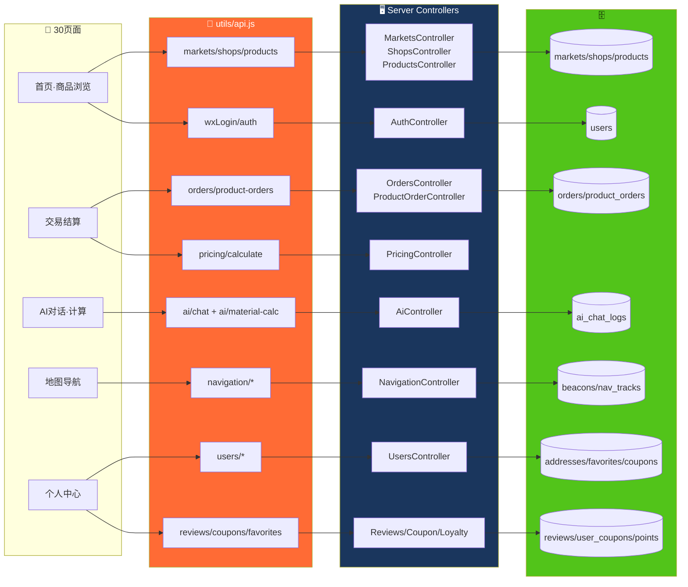

### 2.3 数据降级策略

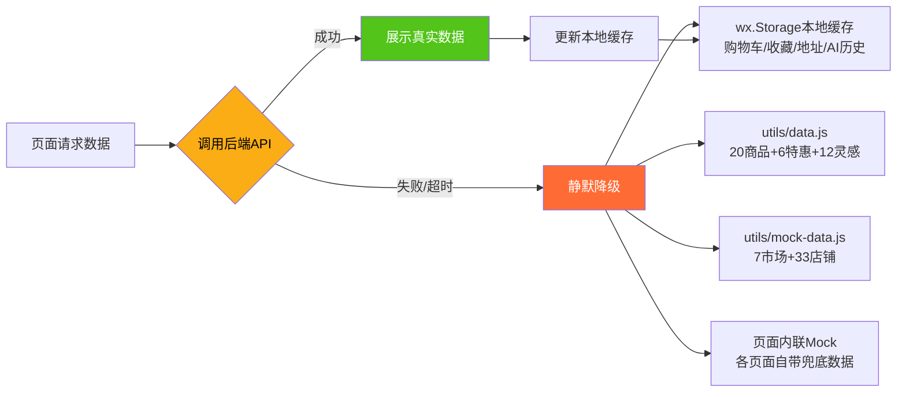

---

## 三、领航员端链路图 (Navigator)

### 3.1 页面路由全景

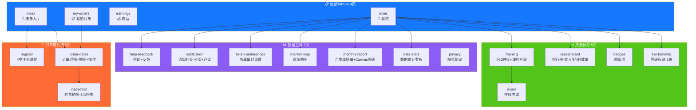

### 3.2 WebSocket 实时通信

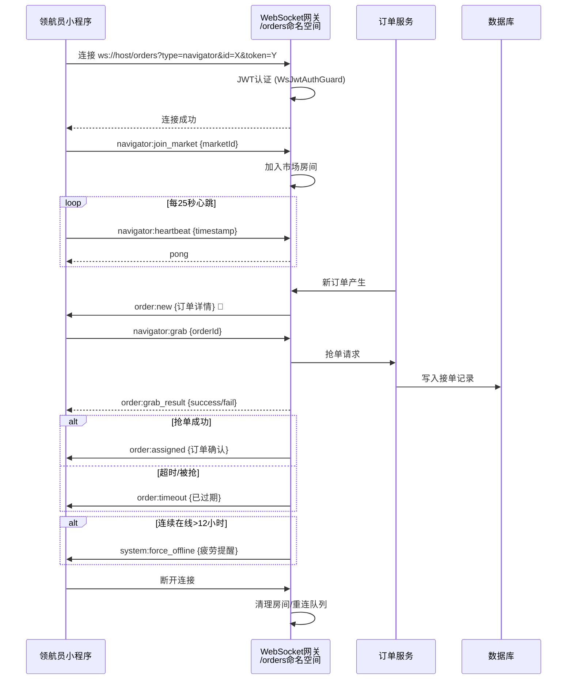

### 3.3 订单履约状态机

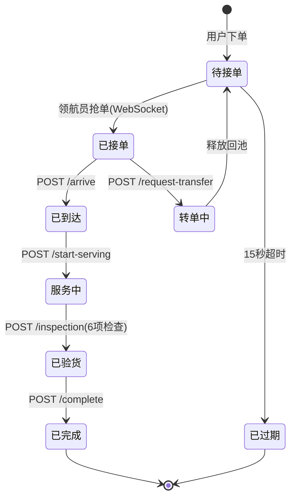

---

## 四、商户端链路图 (Merchant)

### 4.1 页面路由全景

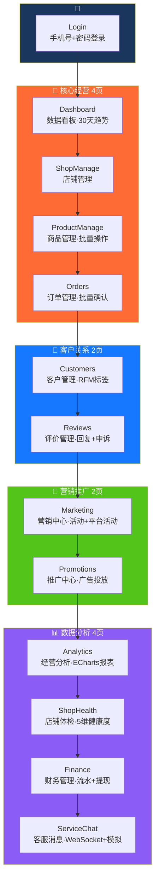

### 4.2 响应式布局适配

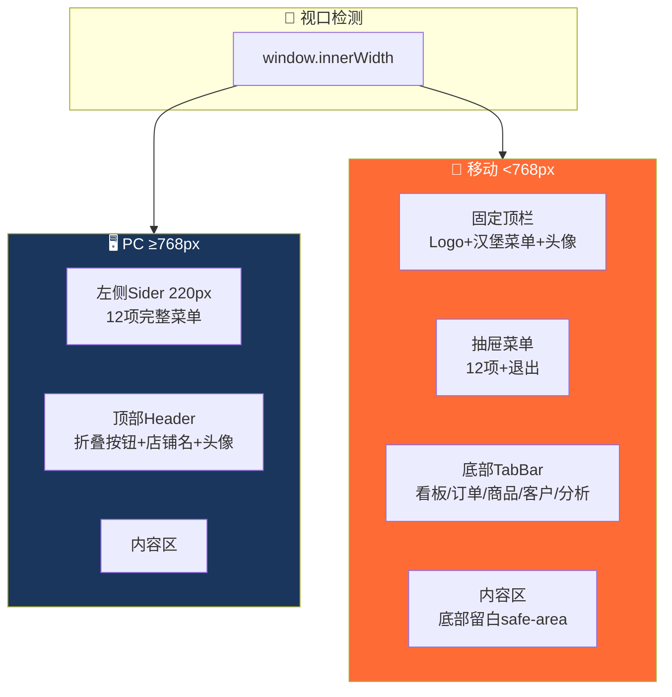

### 4.3 API降级覆盖图

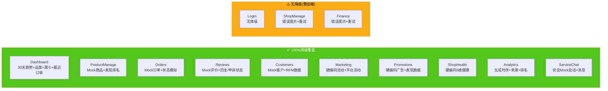

---

## 五、管理后台链路图 (Admin)

### 5.1 19页面路由全景

```mermaid
graph TB
    subgraph 登录["🔐"]
        LOGIN_A[App.jsx 内联登录<br/>admin/admin123 → JWT]
    end

    subgraph 审核中心["✅ 审核中心 3页"]
        SHOP_V[ShopVerify<br/>商家入驻审核·通过/驳回]
        NAV_V[NavigatorVerify<br/>领航员注册审核·身份证查看]
        REVIEW_M[ReviewModeration<br/>评价审核·隐藏/恢复/删除]
    end

    subgraph 运营管理["📋 运营管理 3页"]
        USER_M[UserManage<br/>用户管理·禁用/启用]
        ORDER_M[OrderManage<br/>订单纠纷·仲裁退款]
        MARKET_M[MarketManage<br/>市场管理·CRUD弹窗]
    end

    subgraph 营销体系["📢 营销体系 4页"]
        AD_M[AdManage<br/>广告管理·暂停/投放]
        MKT_M[MarketingManage<br/>营销活动·汇总统计]
        COUPON_M[CouponManage<br/>优惠券·5种类型]
        MSG_TPL[MessageTemplateManage<br/>话术模板·按客户类型]
    end

    subgraph 交易管理["💳 交易管理 2页"]
        PROD_ORD[ProductOrderManage<br/>采购订单·退款审批]
        SETTLE_M[SettlementManage<br/>结算审核·批量打款]
    end

    subgraph 数据运营["📊 数据运营 2页"]
        DASH_A[Dashboard<br/>运营大盘·ECharts双图]
        MKT_ANALY[MarketAnalytics<br/>市场大盘·趋势+对比+CSV导出]
    end

    subgraph 系统运维["⚙️ 系统运维 5页"]
        FINANCE_A[Finance<br/>财务对账·概览+流水+提现审核]
        BEACON_M[BeaconManage<br/>信标管理·蓝牙设备CRUD]
        SYS_CFG[SystemConfig<br/>系统配置·4Tab分组]
        AUDIT_M[AuditLog<br/>审计日志·筛选+详情]
        CUST_SEG[CustomerSegmentManage<br/>客户分层·等级分配]
    end

    LOGIN_A --> DASH_A
    DASH_A --> SHOP_V
    DASH_A --> NAV_V
    DASH_A --> USER_M
    DASH_A --> ORDER_M
    DASH_A --> MARKET_M
    DASH_A --> AD_M
    DASH_A --> MKT_M
    DASH_A --> COUPON_M
    DASH_A --> MSG_TPL
    DASH_A --> PROD_ORD
    DASH_A --> SETTLE_M
    DASH_A --> REVIEW_M
    DASH_A --> BEACON_M
    DASH_A --> CUST_SEG
    DASH_A --> FINANCE_A
    DASH_A --> SYS_CFG
    DASH_A --> AUDIT_M
    DASH_A --> MKT_ANALY

    style 登录 fill:#1A365D,color:#fff
    style 审核中心 fill:#FF6B35,color:#fff
    style 运营管理 fill:#1677FF,color:#fff
    style 营销体系 fill:#52C41A,color:#fff
    style 交易管理 fill:#FAAD14,color:#000
    style 数据运营 fill:#D97706,color:#fff
    style 系统运维 fill:#8B5CF6,color:#fff
```

### 5.2 Admin API → Controller → Entity 映射

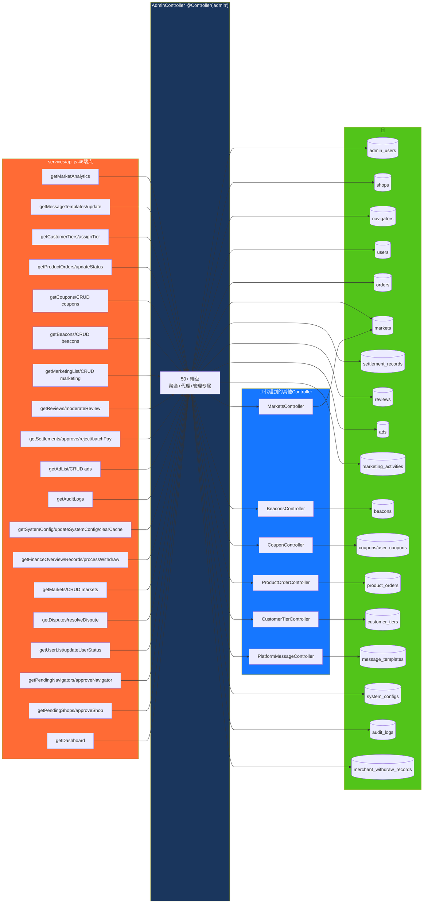

---

## 六、后端服务拓扑图 (Server)

### 6.1 模块依赖关系

```mermaid
graph TB
    subgraph 核心层["🏗️ 核心基础设施"]
        APP[AppModule<br/>根模块]
        TYPEORM[TypeORM<br/>37个Entity·SQLite/PostgreSQL]
        CONFIG[ConfigModule<br/>环境变量·全局]
        SCHEDULE[ScheduleModule<br/>定时任务·全局]
    end

    subgraph 安全层["🛡️ 安全中间件链"]
        HELMET[Helmet<br/>安全头]
        CORS[CORS<br/>白名单localhost:5173/5174]
        RATELIMIT[分级限流<br/>全局100|auth 20|admin 60]
        CSRF[CSRF<br/>HMAC-SHA256·24h]
        SANITIZE[SanitizePipe<br/>XSS净化]
        VALIDATE[ValidationPipe<br/>DTO验证]
        JWT_GUARD[JwtAuthGuard<br/>全局守卫·@Public跳过]
        ROLES[RolesGuard<br/>角色权限·@Roles装饰器]
        AUDIT[AuditLogInterceptor<br/>自动审计·写操作]
        TRANSFORM[TransformInterceptor<br/>统一响应{code,data,message}]
    end

    subgraph 业务模块["📦 32个业务模块"]
        direction TB
        BIZ1[Auth·Users<br/>认证+用户]
        BIZ2[Shops·Products·Markets<br/>店铺·商品·市场]
        BIZ3[Orders·ProductOrder·Dispatch<br/>订单·采购·派单]
        BIZ4[Navigators·NavigatorTier·Training·Gamification<br/>领航员·等级·培训·勋章]
        BIZ5[Reviews·Ads·Marketing·Coupon<br/>评价·广告·营销·优惠券]
        BIZ6[AI·Navigation·Beacons<br/>AI·导航·信标]
        BIZ7[Pricing·DynamicPricing·Settlement<br/>定价·动态定价·结算]
        BIZ8[Analytics·AuditLog·Notification<br/>分析·审计·通知]
        BIZ9[CustomerTier·Loyalty·PlatformMessage<br/>客户分层·积分·话术]
        BIZ10[MerchantCRM·MerchantFinance·ShopHealth<br/>商户CRM·财务·健康]
        BIZ11[Fatigue·Admin·CircuitBreaker<br/>疲劳·管理后台·熔断]
    end

    subgraph 外部依赖["🔌 外部"]
        POSTGRES[(PostgreSQL 17<br/>+ PostGIS 3.6)]
        REDIS_S[(Redis 5.0<br/>Session/缓存)]
    end

    APP --> TYPEORM
    APP --> CONFIG
    APP --> SCHEDULE
    APP --> 安全层
    APP --> 业务模块

    TYPEORM --> POSTGRES
    TYPEORM -.->|开发环境| SQLITE_F[(SQLite)]

    BIZ1 --> REDIS_S
    BIZ6 --> REDIS_S

    style 核心层 fill:#1A365D,color:#fff
    style 安全层 fill:#FF6B35,color:#fff
    style 业务模块 fill:#1677FF,color:#fff
    style 外部依赖 fill:#52C41A,color:#000
```

### 6.2 请求生命周期

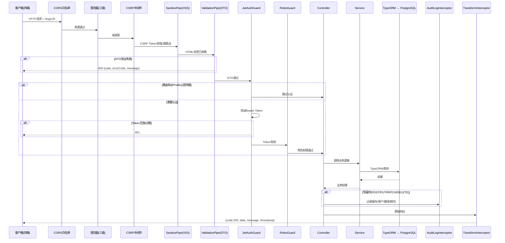

### 6.3 WebSocket 网关事件流

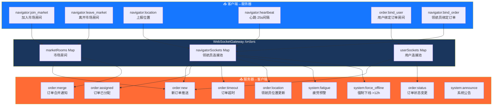

---

## 七、关键业务流程序列图

### 7.1 用户下单全链路（跨三端）

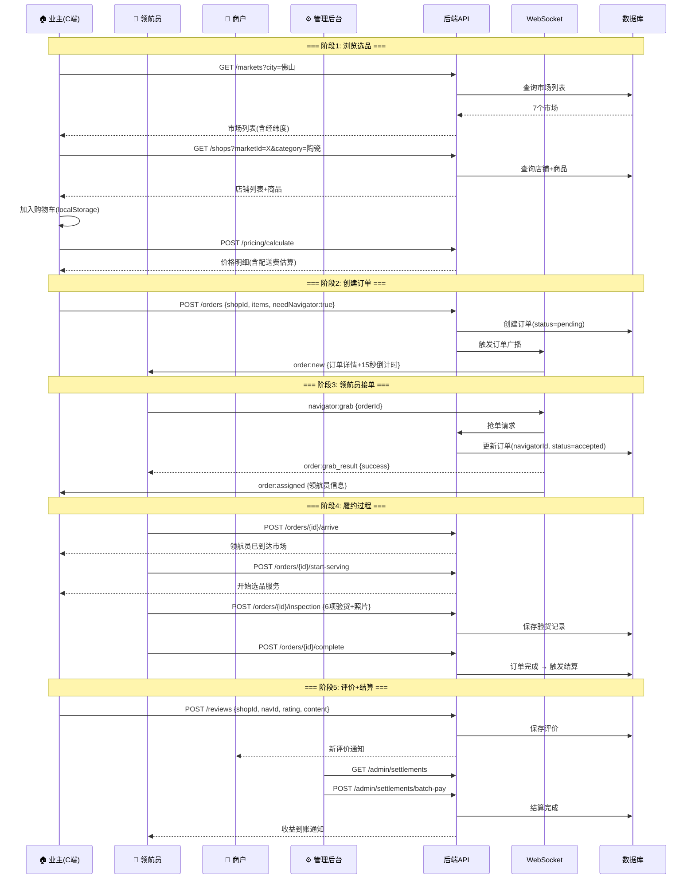

### 7.2 商户入驻审核流程

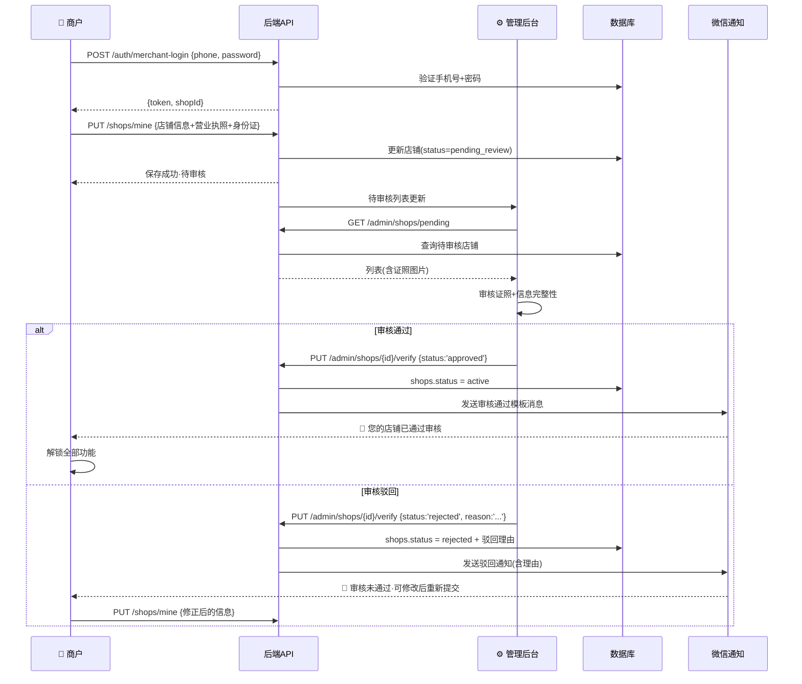

### 7.3 室内导航流程

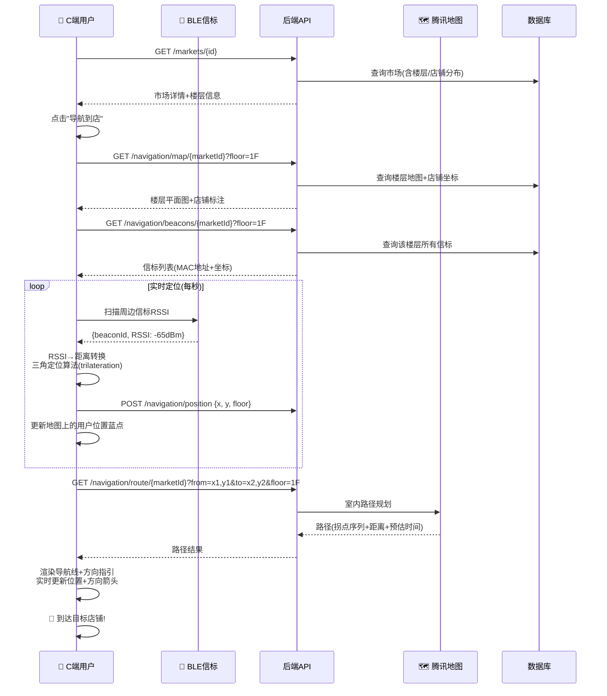

### 7.4 AI对话+材料计算流程

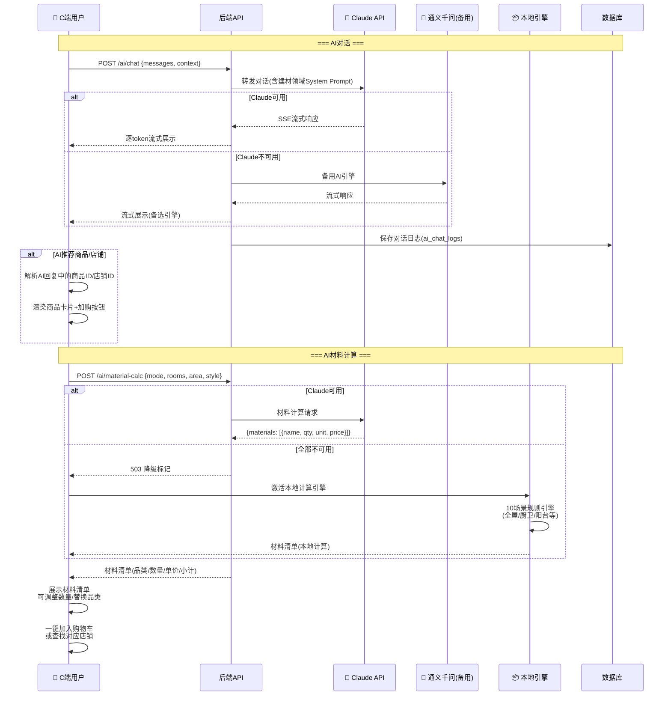

---

## 附录：技术指标总览

| 维度 | C端 | 领航员 | 商户 | 管理后台 | 后端 |
|------|-----|--------|------|---------|------|
| 页面/路由 | 30页 | 21页 | 13页 | 19页 | 32模块 |
| API端点 | ~50个 | ~35个 | ~30个 | 46个 | 200+个 |
| WebSocket | 聊天 | 订单+心跳 | 订单通知+聊天 | - | /orders网关 |
| 数据库表 | - | - | - | - | 37张表 |
| Mock降级 | 全页面 | 部分页面 | 12/13页 | 0(全需API) | - |
| 完成度 | ✅ 100% | ✅ 100% | ✅ 100% | ✅ 100% | ✅ 生产就绪 |

---

> **下一步**: 请审阅以上链路图，标注需要修正/补充的地方，发回给我完善。
> 可直接编辑 Mermaid 代码块内容，VS Code 中安装 `Markdown Preview Mermaid` 插件即可实时预览。
